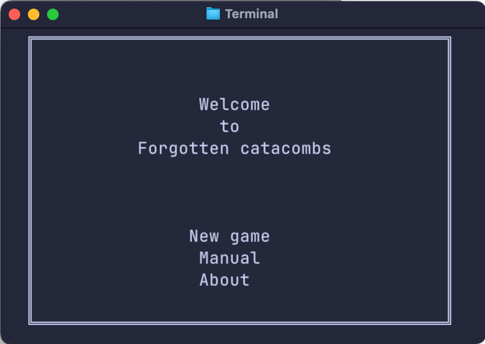

# Forgotten Catacombs

<p align="center">


</p>

Forgotten Catacombs is an old-school roguelike single-player dungeon adventure inspired by [Umoria](https://umoria.org/) and [Shattered Pixel Dungeon](https://shatteredpixel.com/), 
and designed for [Playdate console](https://play.date/) and desktop terminal.

### Game manual

🇷🇺 [Русская версия](manual/manual.ru.pdf)


### Building from source

**📌 Requirements**

- Zig compiler: **version 0.16.0 or later**
- Playdate SDK (for Playdate build only)

**💻 Terminal build**

Build and run the game in terminal mode:
```sh
zig build run -Doptimize=ReleaseFast
```
Output binary will be located in: `zig-out/bin/`

**🎮 Playdate build**

Additional requirements:
 * Playdate SDK installed
 * `PLAYDATE_SDK` environment variable set

Set SDK path (example):
```sh
export PLAYDATE_SDK=~/PlaydateSDK
```
Build and run in emulator:
```sh
zig build emulate -Doptimize=ReleaseFast
```
This will:

 * build the Playdate version
 * launch it in the Playdate Simulator
 * generate a .pdx package

The resulting package will be located in:
```sh
zig-out/forgotten_catacombs.pdx
```


### Contacts & Contributions

This is a hobby project developed in free time.
Feedback, bug reports, and suggestions are very welcome — feel free to open an issue 
for bug reports and suggestions.

While contributions are appreciated, please note:

- Pull requests may not always be reviewed promptly
- Some pull requests may not be merged
- There is no guarantee that all suggestions will be implemented

This is not due to lack of interest, but simply limited available time.
